# 1.21 All Advancements Speedrun Simple Guide

(Translated from: [Source](https://www.bilibili.com/opus/1066006463379406870?spm_id_from=333.1387.0.0). @acewhite - 22 June 2025)

# Preface

As the speedrun scene develops, 1.16 All Advancement speedrun times have achieved quite a high standard. As 1.21 brings more diverse content, runners have attempted playing AA speedruns on this version. But there are 122 advancements in 1.21, which is 42 more than 1.16; related resources and strategies are all over the place - not the most friendly for a newcomer trying 1.21 AA. (I have played 1.21 AA for 9 months, has sufficient knowledge in this version. Here are some resources, strats and some of my tips to guide newbies. Please point out if there are any miscomprehensions.)

# Table of Contents

1. [1.21 Biome Generation](#1---121-biome-generation)  
2. [Structure Generation Logic](#2---structure-generation-logic)  
3. [Differences between 1.21 Subversions](#3---differences-between-121-subversions)  
4. [Resetting](#4---resetting)  
5. [Early Game](#5---early-game)  
   5.1. [Any%](#51---any)  
   5.2. [First End Enter](#52---first-end-enter)  
   5.3. [Enchanting](#53---enchanting)  
6. [Mid-game](#6---mid-game)  
   6.1. [Early Mid-game](#61---early-mid-game)  
   6.2. [Trident, Shells and Ancient Cities](#62---trident-shells-and-ancient-cities)  
   6.3. [Exploring](#63---exploring)  
   6.4. [Igloo and Mansion](#64---igloo-and-mansion)  
   6.5. [Nether](#65---nether)  
   6.6. [Trial Chambers](#66---trial-chambers)  
   6.7. [Trail Ruins](#67---trail-ruins)  
   6.8. [Miscellaneous Advancements](#68---miscellaneous-advancements)  
   6.9. [Charts: AA Mid-game Odds](#69---charts-aa-mid-game-odds)  
   6.10. [Where Does Mid-game End?](#610---where-does-mid-game-end)  
7. [End-game](#7---end-game)  
   7.1. [Second Outer End](#71---second-outer-end)  
   7.2. [Bees, HDWGH Setup](#72---bees-hdwgh-setup)  
   7.3. [Frogs, Sniffers](#73---frogs-sniffers)  
   7.4. [Miscellaneous, Third Outer End](#74---miscellaneous-third-outer-end)

---

# 1 - 1.21 Biome Generation

The biggest difference in versions 1.16 and 1.21 is the massive overhaul in biome generation logic. 1.16 focuses on searching for biomes, while 1.21 focuses on searching for biome-specific resources.

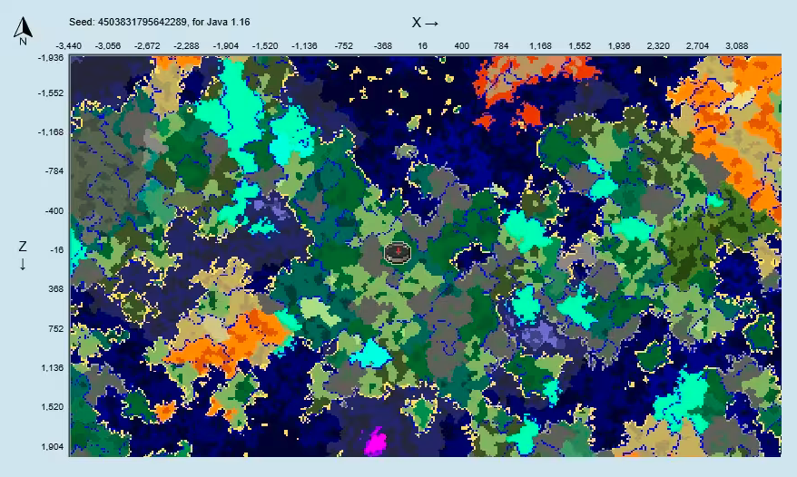

*Fig. 1.1: 1.16 biome distribution map. Source: [Chunkbase](https://www.chunkbase.com/apps/seed-map)*

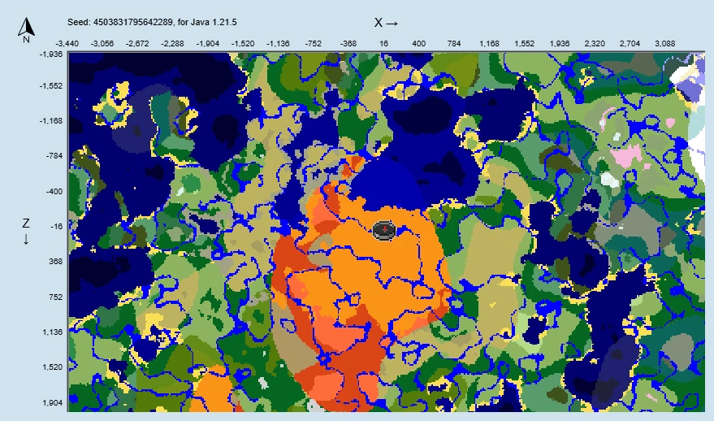

*Fig. 1.2: 1.21 biome distribution map. Source: [Chunkbase](https://www.chunkbase.com/apps/seed-map)*

From the biome distribution figure, we can notice that biomes in 1.16 are distributed in "blocks", and that there is no obvious pattern behind the distribution. As we all know there are 5 groups of rare biomes in 1.16: mega taigas, badlands, snowy tundra, jungle and mushroom islands. In 1.21 however, biome distribution resembles as stripes, and the pattern in the generation is relatively obvious. In simple words, 6 density function parameters define biome generation: Temperature (`T`), Humidity (`H`), Continentalness (`C`), Erosion (`E`), Weirdness (`W`), and Depth (`D`). A lot of resources required in AA runs are also based on biomes, so here is a list I compiled, indicating biomes to its resources.

*Table 1.1: List of biomes and its resources. Translator note: I thought this would really benefit from some visual organization, so here's a table I made, content translated.*

To play 1.21 AA, one must understand the 6 parameters and its relation to biome generation. Fortunately the values of the 6 parameters are all labeled on the F3 screen.

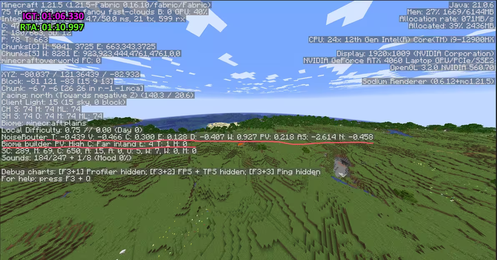

*Fig. 1.3: In the F3 screen, `NoiseRouter` indicates the 6 parameter values for the density functions, `Biome builder` indicates the respective levels for the 6 density functions.*

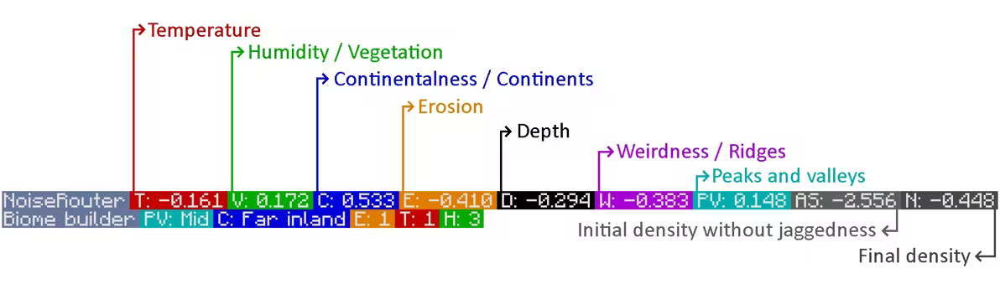

*Fig. 1.4: A more in-depth explanation of the biome values. Source: [Minecraft Wiki](https://minecraft.wiki/w/World_generation#/media/File:World_generation_debug_info_explanation.png)*

In the F3 screen, `NoiseRouter` indicate the noise values used to generate terrain and biomes, while `Biome builder` indicate the {group respective to the noise values}. Here is a summary on what does the 6 density function parameters mean, read more on the [Minecraft Wiki page](https://minecraft.wiki/w/World_generation#Biomes) about biome generation.

- **Temperature**

Determines whether a tropical biome, a warm biome or a cold biome generates at a location. Tropical `T = 3 ~ 4`, warm `T = 1 ~ 3`, cold `T = 0`. Note that temperature generation is smooth, which means tropical biomes cannot collide straight into cold biomes (common in 1.16).

- **Humidity**

Reflects the vegetation of the biome at a location. Note: desert can take on any value.

| Value     | Vegetation Level                                     |
|----------|------------------------------------------------------|
| 4        | Highest amount of vegetation (wooded badlands, jungle) |
| 2 ~ 3    | Moderate (forest, birch forest)                      |
| 0 ~ 1    | Lowest (plains, meadows)                             |

- **Continentalness**

Reflects the position relative to oceans, for differentiating land and sea. For example, mushroom fields have the smallest continentalness, meaning oceans have to be big to some extent to generate a mushroom island in the middle.

| Range           | Biome Type     |
|----------------|----------------|
| -1.2 ~ -1.05    | Mushroom fields|
| -1.05 ~ -0.455  | Deep ocean     |
| -0.455 ~ -0.19  | Ocean          |
| -0.19 ~ -0.11   | Coast          |
| -0.11 ~ 0.03    | Near inland    |
| 0.03 ~ 0.3      | Mid inland     |
| 0.3 ~ 1.0       | Far inland     |

- **Erosion**

Reflects the “erosiveness” of a location. Lower erosion: steeper and more jagged (mountainous biomes); higher erosion: flatter, less jagged (plains). High erosion terrain (eg. swamps, WS biomes) are rarer in game.

- **Weirdness**

(As seen from `NoiseRouter`, not `Biome builder`)  
Determines whether to generate a "weirder" variant (eg. for Jungle: Bamboo Jungle). Unaffected from some biomes (+ Pale Garden (1.21.5) ) 

- **Depth** 

(As seen from `NoiseRouter`, not `Biome builder`)  
Determines placements of underground biomes, increases by 1/128 every 1 block down.

| Depth Range     | Biome Type                                      |
|----------------|-------------------------------------------------|
| 0.2 ~ 0.9       | Dripstone Caves (hi-`C`), Lush Caves (hi-`H`)       |
| 1.1             | Deep Dark (lo-`E`)                                |
| Other cases     | Replaced by surface biomes                      |

Knowing the meaning of the 6 parameters, we can then search for biomes according to how the values change over time, which can lead us to biome-specific resources. This is important in AA mid-games.

# 2 - Structure Generation Logic

There are a lot of connections between AA speedruns and structures in game. Except for strongholds, all structures follow a principle controlling where it spawns:

First divide the world into multiple square regions with side length $M$ (in fig2.1, regions divided by black edges), there can only exist at most one point for structure generation in these regions; then from the northwest corner, draw a smaller square with side length $N$ (in fig2.1, green regions), the point of generation can only be in this region, the center of the structure is also in this square. In other words, structures in game can be viewed as generated on evenly spaced squares, with distance $D = M - N$ and side length of $N$. We will be using this fact very commonly, for example searching for ancient cities.

Refer to the article below for more; the mechanics in Bedrock are similar to Java, with different parameters.

[hyperlink2.1](https://www.bilibili.com/opus/373931754147821623)

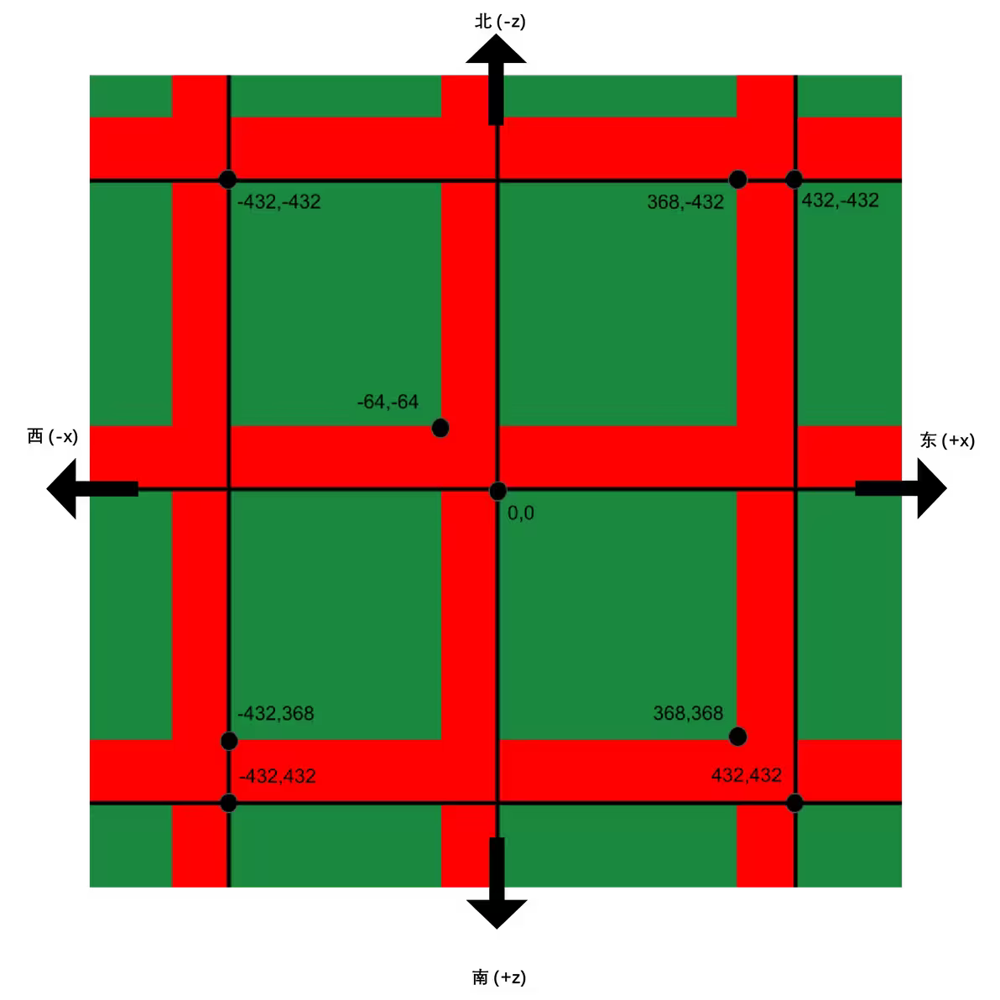

*Fig. 2.1: Game structure generation diagram (except strongholds). Here $M = 27$ chunks, $N = 23$ chunks. Translated from source: [Minecraft Wiki](https://zh.minecraft.wiki/w/%E4%B8%96%E7%95%8C%E7%94%9F%E6%88%90#/media/File:Java_Nether_Structure_Generation1.png)*

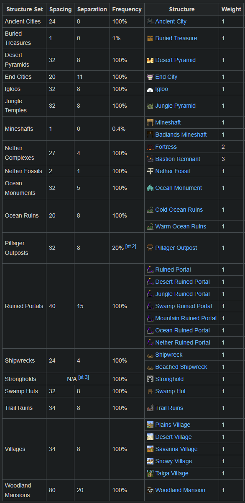

*Fig. 2.2: Table of parameter values for in-game structure generation. Second column: $M$ (side length of the big square), third column: $D$ (spacing between small squares). Source: [Minecraft Wiki](https://minecraft.wiki/w/World_generation#Structures)*

# 3 - Differences between 1.21 subversions

There are quite some differences and fixes in subversions in 1.21, hence here are the diffs between subversions, for players to choose their preferenced subversion.

- **1.21 - 1.21.1**
	- (+) Trial Chambers
	- (+) Lead-able boats
	- (+) Instant travel through nether portals while riding
	- (+) TNT, ender pearl instantly travel through nether portals
	- (!) With mace off-hand, feeding parrot with cookie gives "Over-Overkill"

- **1.21.2 - 1.21.3**
	- (+) Bundles (allows for 2-shulker playstyle!)
	- (+) New Trial Chamber structures
	- (+) Ender pearl force loading
	- (+) Able to feed any meat to wolves
	- (+) Removed boat break incidents
	- (+) Stew recipes shown in recipe book
	- (+) Beehive states in advanced tooltips
	- (-) Removed pearl hanging
	- (-) Removed void trading
	- (-) Removed parrot "Over-Overkill" skip

- **1.21.4**
	- (+) 2 Pale Garden advancements
		- Pale Garden becomes rarest biome, overtaking WS Gravelly Hills
	- (-) Removed sneak sprinting

- **1.21.5**
	- (+) Lodestone overhaul
		- Recipe: 1 iron (previously netherite) ingot + 8 chiseled stone bricks.
		- Found in ruined portal chests. Pool is separate, i.e. doesn't affect other loot.
		- "Country Lode" now under Adventure (previously Nether) root

	- (!) Pale Garden unrestricted by Weirdness parameter, i.e. area is enlarged a bit; still rarest biome. Mansions can now generate here

	- (+) Added bundle to village chests, 1/3 chance of appearing

	- (+) Swimming is enabled while elytra activated underwater (previously unable to swim, slow movement speed)

	- (!) Cartographer trade changes
		- Discussed below at igloo split.

	- (-) Debuffed wandering trader shell trade odds (8.62% (1.16) -> 7.35% (1.21) -> 6.94% (1.21.5)) as AA-useless items added to trading pool

	- (+) Camels now naturally spawn in deserts, in packs of 1 - lead-less camel breeding made possible

	- (!) Creaking spawns locked by day-night cycle, daytime thunderstorms no longer spawn creakings

	- (!) Flying through climb-able blocks with elytra now halt gliding / flying - no longer able to glide down igloo ladders. Be aware of nether vines too

# 4 - Resetting

One prerequisite to AA runs is to have a good start. The bare minimum is to have, within 40 chunks from spawnpoint, a desert temple with at least 10 gunpowder, a village nearby, and a surface lava pool.

Going back to 1.21 biome generation logic: desert temples generate in deserts, and deserts have temperature value `T = 4`, which is quite an extreme value: the game tends to generate biomes of `T = 1 ~ 3`, which are warm biomes. Deserts also have erosion values of `E = 2 ~ 5`, commonly between `E = 3 ~ 4` which {indicates moderately eroded terrain}, which means deserts take up a lower percentage in total world area (2.473%), which means: **resetting for deserts is relatively more difficult than 1.16**. As desert seeds are more difficult to roll, temple distance can be more relaxed to around a radius of 40 chunks. As magma ravines do not exist anymore, using ruined portals or surface lava pools are the only feasible enters. 

Here are some scenarios after having rolled a desert seed:

1. Most ideal: Lava pool, temple, village, trees in close vicinity. Note: avoid rolling spawns that are directly in villages / close to villages, as the shulker might die to iron golems when sent back to spawn. Not the most ideal for HDWGH too.

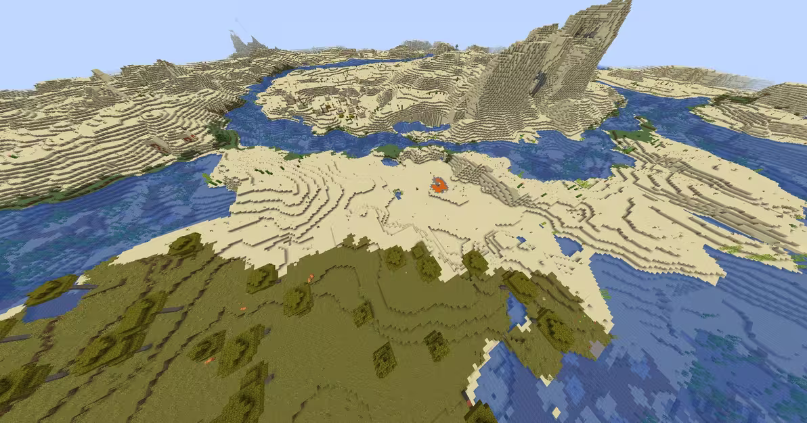

*Fig. 4.1: The most ideal spawn. Seed: -6906520426549049338*

2. Desert with stone shore: Store shore generates at erosion values of `E = 0 ~ 2`, and badlands (`E = 0 ~ 3`) are low-erosion biomes. This indicates that such deserts are normally not big (conversely, with large badlands). One can go on and reset the seed.

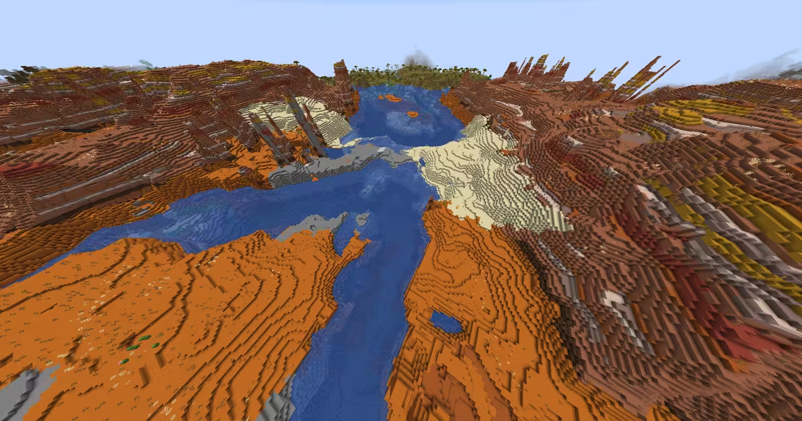

*Fig. 4.2: Desert with stone shore. Seed: -8446744073709551248*

3. Mangrove-Desert combo: Mangroves generate at values `T = 3 ~ 4, E = 6`. This indicates the desert, when nearby mangroves, has an erosion value of `E = ~ 5`. Biomes like {windswept biomes} will generate here, making the terrain of the desert more jagged. If one finds this troublesome, they can go on and reset.

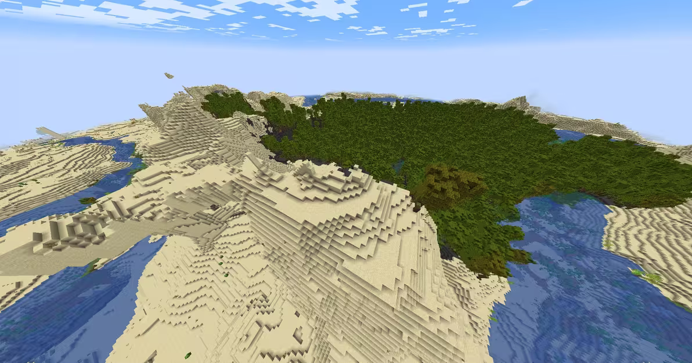

*Fig. 4.3: Mangrove-Desert combo. Seed: 5000000000000000002*

# 5 - Early game

## 5.1 - Any%

(Disclaimer: I am not the best at any% - here are just my opinions)

Normally when resetting for an AA seed, because resetting is difficult, there's no need to rush entering the nether (normally until 8 minutes is still good margin). Carrying a lava bucket is a must before entering (dealing with brutes), and also gravity blocks for looting chests.

Scan for a bastion upon entering. E-counter scanning, in 1.21, for treasure and stable bastions still works sub-optimally, however for housing and bridge bastions are not the best personally. Use the pie chart to check for brutes, to locate bastions.

Check the [Minecraft Wiki page](https://minecraft.fandom.com/wiki/Bastion_Remnant#Structure) for brute spawning distribution. In simple terms, 1.16.1 piglins with a chestplate and sword are equivalent to 1.16.2+ brutes.

Triple chest rampart (housing, stables, bridge): Normally 2-5 brutes; 
Single chest rampart (housing, bridge): 90% no brute;
Stable ramparts with chest: Almost guaranteed brutes;
Bridge lodestone chest: Almost guaranteed brute.

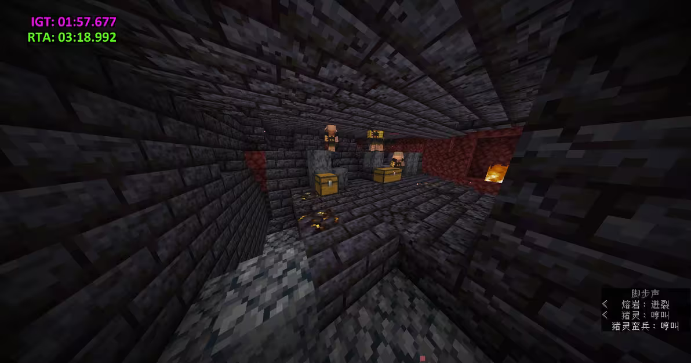

*Fig. 5.1: Triple-chest rampart. 4 brutes are seen.*

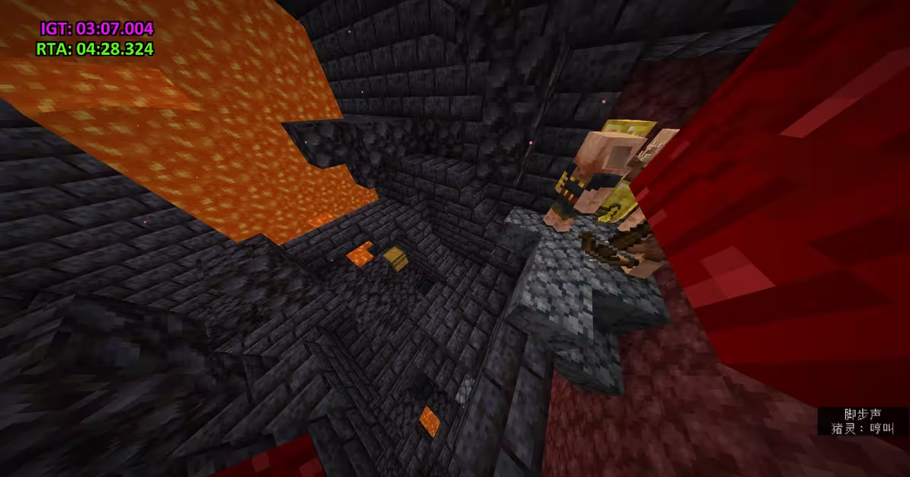

*Fig. 5.2: Bridge lodestone chest. 1 brute is seen.*

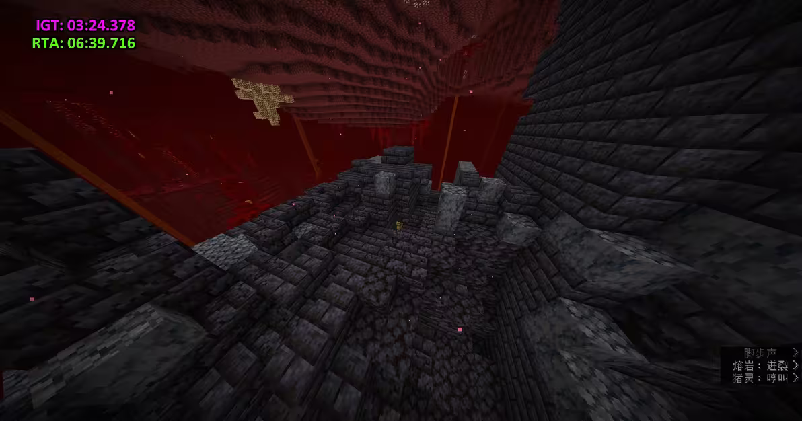

*Fig. 5.3: Bridge single-chest rampart. No brutes are seen.*

For treasure, the top chest rooms will spawn 2-4 brutes each, the connecting bridge will spawn 1-3 brutes, so normally runners don't do trading on top, and instead do bottom treasure trading. The bottom treasure bridge will spawn 1-3 brutes, and middle treasure part will spawn 1-3 brutes. The bottom most floor will spawn brutes on the four corners (worse case all brutes); the 5th floor (from bottom - same level as lava basin, normally runners check for a chest before going onto the bridge to start their route.) will also spawn brutes. Trading is normally done at the corners of the bottom floor.

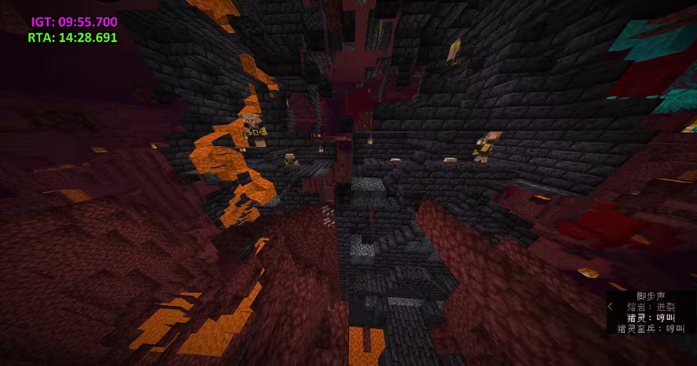

*Fig. 5.4: Top chest rooms. 2 brutes (left) and 3 brutes (right) are seen.*

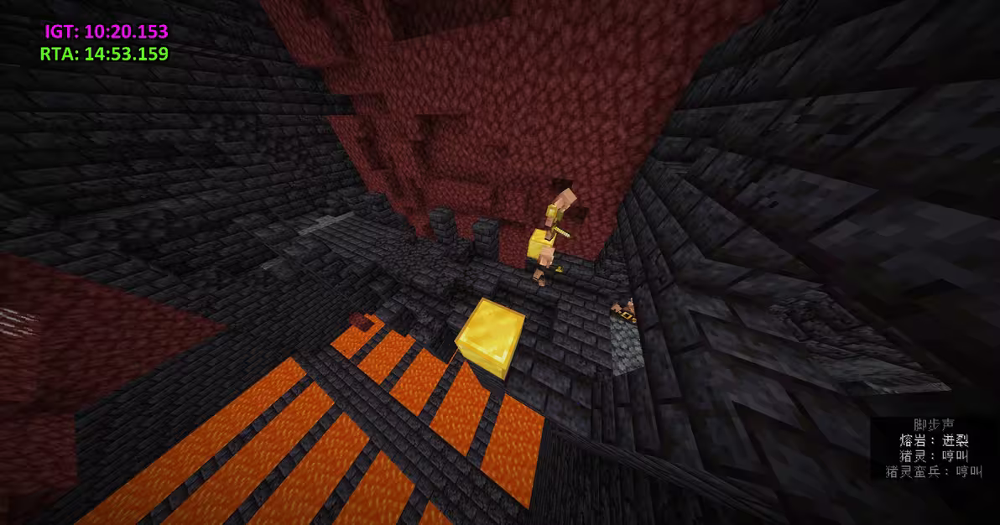

*Fig. 5.5: Bridge connecting the treasure room and the tower. 2 brutes are seen.*

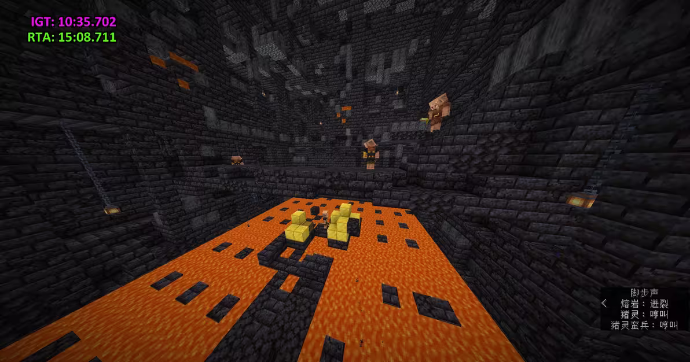

*Fig. 5.6: Bottom treasure. On the bottom bridge, 2 brutes are seen; middle treasure part: 1 brute is seen.*

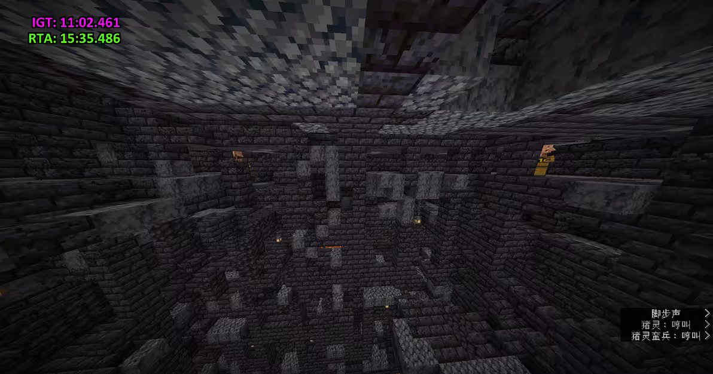

*Fig. 5.7: 5th floor of the treasure room. 2 brutes are seen.*

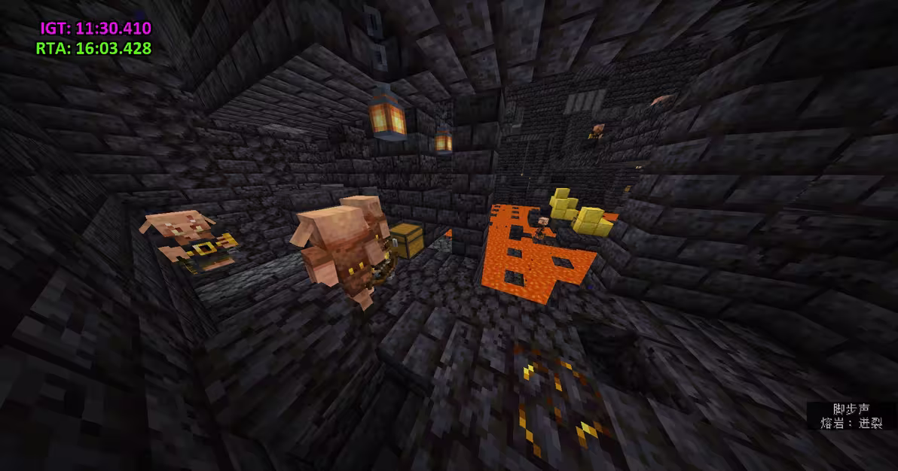

*Fig. 5.8: A corner of the 1st floor of the treasure room. 1 brute is seen.*

For bridge bastion trading routes, there are less brutes, after dealing with the brutes a normal trading route would suffice. For housing, I'd been following the route from this video:

[hyperlink5.1](https://www.bilibili.com/video/BV1oHkzYJEKG/)

Stables have a lot of brutes, hard to guarantee trades, normally when seeing stables I just reset. For treasure, what I do, is approach from the back side of the {high chest rooms}, lava the brutes and loot the chests, go down the bridge and lava the brutes, then boat down to middle treasure, deal with brutes then trade at one corner. (Do note that this is slow.)

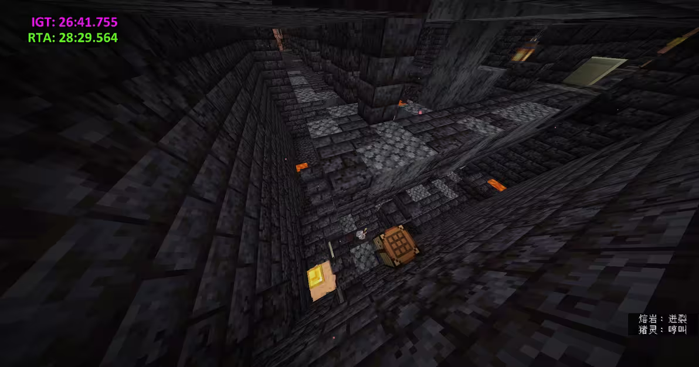

*Fig. 5.9: Common trading hole spot in the treasure room.*

The biggest issue with Any% are ender pearls. The odds and quantity of obtaining pearls from bartering in 1.16.2+ are cut in half, which makes obtaining 12 pearls a pretty difficult task. Here are the table of probabilities of getting 12 pearls from bartering in 1.16.2+, considering one successful barter provides 3 pearls:

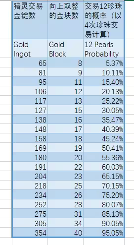

*Fig. 5.10: Table of odds of getting 12 pearls from bartering in 1.16.2+, considering one successful barter provides 3 pearls. Gold block counts are rounded up.*

As you can see, trading 15 gold blocks for 12 pearls has a 30% success rate, with one gold block adding around 5%. Housing provides 16 gold blocks; the bridge statue provides 16, adding up to 28 if hidden gold blocks are mined. One good bottom stables provide *at most* 12 blocks; bottom treasure usually contain 20+ blocks, 30+ blocks are normal too considering chest may also contain some. 

To summarize: 
Housing is safe, but pearl rates are low; 
Bridge is the most valuable, with the least brutes and the most gold; 
Stables is the least valuable, with the least promising strucutres and high number of brutes; 
Treasure is considered high-risk-high-return, with the most brutes and gold, almost guarantees 20+ pearls, but is more time-consuming.

When bartering, when obtaining leather and string, immediately craft a bundle (just one is enough) for unstackable, low-count items, eg. gunpowder, debris. As the barter loot table in 1.16.2+ is different from that of 1.16.1, consider keeping 4-6 fire resistance pots, 2-4 stacks of blackstone, 1 stack of gravel, some iron, crying obsidian, 1-2 stacks of soul sand, 1-2 stack of string and 1 stack of spectral arrows.

If bartering gives only 8-11 pearls, it is okay to search for warped forest endermen. (Betting on portal eyes is not recommended: 28% for 0 eye, 38% for 1 eye, 23% for 2 eye.)

Next up is to find a fortress for blaze rods. As 1.16+ nether terrain get sh1tty, most of the time there is no extra / 2-5 extra for traveling around, so one has to walk to the fortress and blind travel spot - this is a bit of a headache. Compared to 1.16 this will take 3-10 minutes longer, depending on the distance between the bastion and the fortress, the fortress and the blind spot. Note: don't throw fire resistance potion through the portal, it will act as an entity, travel through the portal, and splash at the other dimension. Also to note, when doing double travel, low y-value doesn't guarantee an Eye Spy, especially when encountering negative y-value strongholds. Building a portal at high-y doesn't guarantee a surface spawn either (you can spawn underground). Just follow the coordinates given by Ninjabrain Bot (of course, given that measurements are accurate). Keep in mind that 1.21 cave heights can differ a lot, you can fall to your death.

## 5.2 - First end enter

Kill the dragon (note: get "Free the End" advancement), go to the outer ends, search for a ship. When finding a ship, no shulker transport is needed for the first end session - we can wait till leads are obtained (translator note: 1.21.6 lead recipe and flying mechanism?). Record coordinates with Ninjabrain Bot, reserve a shulker (fig5.11) for shulker transport later.

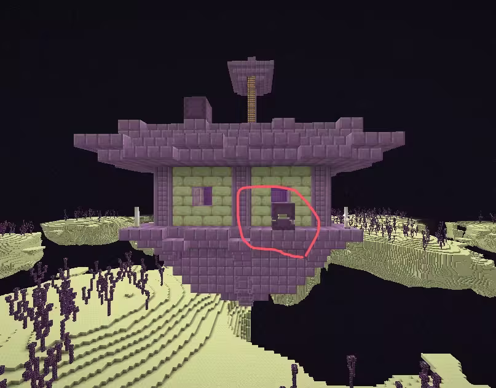

*Fig. 5.11: Reserve one shulker as circled. Actually the top one also works.*

Then search for more end cities. The method to search for end cities is to look at chunk coordinates through F3, when $X - Z = 20n$ ($n$ is a whole number) fly in the direction of 45 or 135 degrees. This is because the world is first divided into 20-chunk wide square regions, then the most northwest 11-chunk square subregion is used to generate, flying on the diagonals allow us to see the most number of regions.

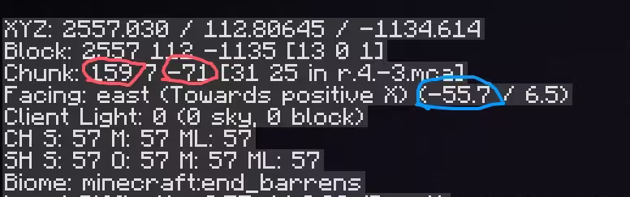

*Fig. 5.12: The red circles on the F3 screen indicate current chunk coordinates; the blue circle indicate the angle you're currently facing.*

Collect 4+ elytras, 1-3 stacks of obsidian, 32+ diamonds, 31+ iron, Spire trim template, and beetroot seeds. Doing 2 or 3 shulkers are subject to personal preference. Armor is recommended to have at least Unbreaking III or Mending, as 1.21 AA involves a lot of combat, armor are prone to breaking.

The pie chart on some subversions are bugged - the gateway part on the pie chart does not go off. To search for end gateways, the first method is to locate by using the pie chart. When encountering the pie chart bug, a relog is needed - you lose the first enchant. (First enchant: Without relogging, the first enchant of every world is always the same.) The second method is to turn down brightness to 0, and spot the glow from end gateways. Reverting back to 500% brightness also loses first enchant - you can only return to the main menu to revert brightness back to 500%. It is up to the runner's discretion if the first enchant is needed.

## 5.3 - Enchanting

After exiting end, record spawnpoint coordinates with Ninjabrain Bot (needed for sniffers later). Since Bolan lapis are not viable anymore, search for an open cave, or an underwater cave if you have a Respiration helmet. (Underwater caves has a higher probability of spawning ores than open caves.) When caving, get at least 5 copper, at least half a stack of lapis, and redstone if found. Grab two axolotls if found; kill glow squids for the glow ink sac, if found. After caving, return to surface, chop wood, and try to find a place with chicken (not mandatory) for enchanting. Smelt copper while enchanting. Here is a list of enchants needed:

Necessary: 
- Sword - Looting III; 
- Pickaxe - Efficiency IV+; 
- Helmet - Respiration III; 
- Boots - Depth Strider III; 
- Any tool - Silk Touch;
- Book - Unbreaking III; 
- Crossbow - Piercing IV

Recommended: 
- Sword - Smite IV (Iron Sword: Smite V);
- Pick-Axe-Shovel - Efficiency IV; 
- Helmet - Aqua Affinity; 
- Boots - Feather Falling IV; 
- All tools and armor - Unbreaking III / Mending;
- Elytra - Mending;
- Book - Channelling

If first enchant is available, do Looting II for helmet, or if Looting III is obtained, do Respiration III for helmet.

It's best to have Unbreaking III / Mending on armor. Sword needs to have Looting III, not level II, as creepers are the main source of gunpowder in 1.21 AA. It's best to have Efficiency V on diamond pickaxe, as a lot of mining is needed for searching trial chambers and ancient cities. It's best to have both Respiration (more important) and Aqua Affinity, for excavation and monuments during mid-game. it's best to have feather falling on boots, as falling is common in 1.21, and no pearl hanging for versions past 1.21.2. If you are not confident for a sub-10 hour completion, Mending on elytra is a must. Mending is not obtainable through the enchanting table, you can obtain books from ruins (especially ancient cities) and villager trading. When elytra repairs exceed 9 levels, you can trade for a Mending book. Channelling doesn't need to be rolled on the enchanting table, ancient cities or villager trading also provide the enchant.

After enchanting, mine bookshelves, enchanting table and anvil, get the copper. Collect 3 eggs if there are chicken nearby (1 for pumpkin pie, 2 for cake), breed and kill the chickens for 3 feathers, for 3 brushes (recipe: 1 feather, 1 copper ingot, 1 stick). There are chances for chicken later during mid-game if you can't find chicken now.

Check the time of the day now: if it's night, farm creepers first, then farm salmon (set render distance to 5 for spawns) at the closest broad river when it's day; if it's day, farm salmon straight away, then farm creeper the following night. Due to how biomes generate, deserts can only be adjacent to warm and lukewarm ocean, which is why we only farm salmon in rivers, but not cod. 35-45 fish is enough. After that, mid-game starts; fish-kill split has to be at least sub-1:30 to catch up a sub-10h pace.

# 6 - Mid-game

The logic for mid-game exploring, is to check out what's around your spawnpoint. Follow quadrants for exploring, then blind travel for missing rare resources during end-game. One important principle to keep in mind is: do whatever is available. Another point to remember: search for resources in large (area) biomes, not small biomes. There are some details here.

## 6.1 - Early mid-game

After killing fish, explore the spawnpoint desert and ocean, and loot all the temples in the spawnpoint desert: a stack of bones, a stack of string, 4 spider eyes (2 for armadillos, 1 for ABD, 1 for fermented spider eye), 3 rotten flesh (2 for wolves, 1 for ABD), all the loot minerals, and all the TNT. (1.21.5: Breed camels (cactus) if you get the chance.) Tame all types of cats in spawn villages, and breed a pair for 2B2. Note that 1.21 cats are less likely to approach you, so it's most likely that you'll be chasing feeding cats. Collect at least a stack of haybales from villages. After exploring the desert, it's common to have a biome with animals connected. If you haven't obtained a brush, kill chickens for feathers to make brushes. In biomes with animals you can breed sheep / cows then kill for meat / cooked meat, and craft leather boots. If there is savanna plateau / wooded badlands, try looking for wolves. Also look for armadillos to breed when it's day, as they will stop breeding when they sense players sprinting, or undead mobs around them. Use up two brushes for 8 scutes for 2 wolf advancements, "Good as New" and "Shear Brilliance".

After getting brushes, explore the ocean, check for warm ocean ruins and excavate for at least 2 sniffer eggs; if you get pottery sherds, keep it; when eventually 4 of them is collected, craft a decorated pot for the "Careful Restoration" advancement. The odds for 2 sniffer eggs are: 25% from 15 suspicious sand, 50% from 25, 75% from 40, and 99% from 100. Every ruin will randomly swap 5 sand blocks into suspicious sand.

Remember to loot shipwrecks when looting oceans, as it will be a source of paper (gunpowder from creepers). Loot the mineral chest as well, and loot carrots, potatoes, poisonous potatoes and leather boots from the food chest.

If you find an ocean monument, record its coordinates with Ninjabrain Bot, and build a nether portal. (No items / players should go through for now!) This is so that during HDWGH, we can just build a portal on the nether roof and exit through the portal we built. If an entity enters the portal, another portal will spawn on the other side - an unintended portal during end game is not good.

After excavating 2 sniffer eggs, if spawnpoint is close, return back to spawnpoint to setup for hatching. Here are the two setups, as shown in Figure 6.1 and 6.2:

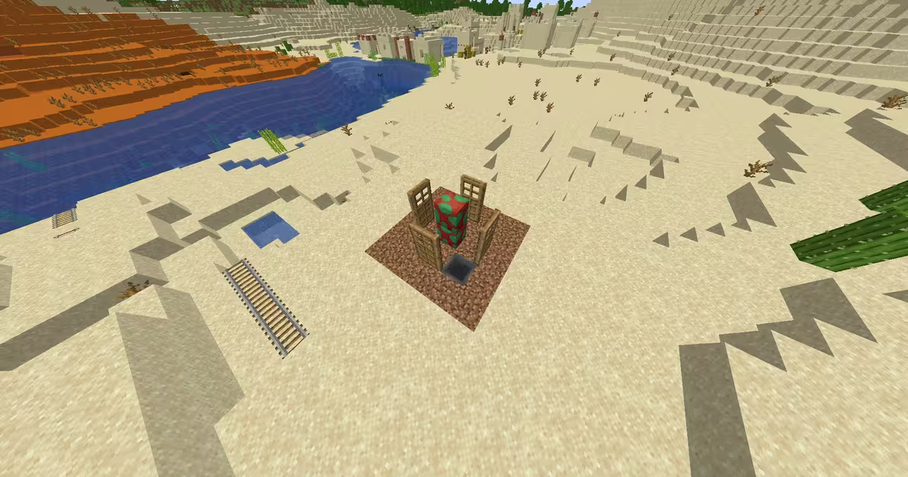

*Fig. 6.1: One sniffer egg hatching setup, 4-door*

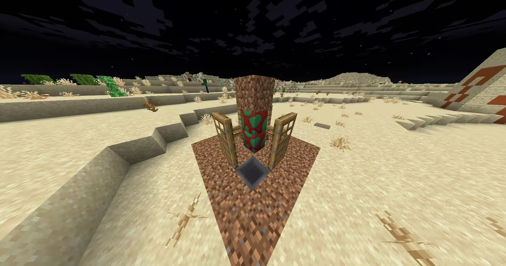

*Fig. 6.2: Another sniffer egg hatching setup, 2-door, behind blocked with fences*

Note that the hopper is placed at the southeast corner. The 4-door setup makes it so that the second sniffer cannot dig, which makes the seed production lower; to prevent this, use the 4-door setup for each egg, or the better 2-door setup with fences. It takes 60 minutes from placing down the egg to maturing, so this should start at the start of mid-game.

## 6.2 - Trident, shells and ancient cities

After finishing setting up the sniffer eggs, search for low erosion terrain, target is to find large rivers and ancient cities. Ancient cities are structures with high priority. 

Back to 1.21 biome generation logic, low erosion indicate a more jagged terrain, this applies to terrain underwater as well - low erosion means deeper rivers, which means higher rates of spawning drowned. Spawning river drowned is pretty fast, and it only takes around one night to get a trident and all shells (given that you are not unlucky). Don't farm in the day however, due to daytime brightness - only the deepest levels spawn drowned. You can record coordinates, finish other tasks and come back at nighttime. Of course, you can force daytime farming, by building a light barrier platform to spawn drowned. And if you get a good ocean, and all has been obtained from just ruins, then river drowned farming is not needed. Ocean ruin spawns are debuffed in 1.21.

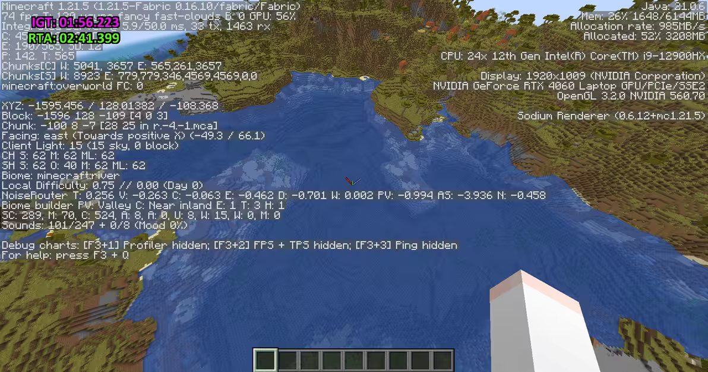

*Fig. 6.3: A classic example for a farming river, from the F3 screen (`Biome builder`): `E = 1`, which makes the river deep.*

Ancient cities is another important aspect. They contain a plenty of resources, especially for all advancements: redstone, comparator, target block, compass, bones, enchanted books, glow berries, music discs, name tags, leads, amethyst shards, sculk catalysts, enchanted golden apples, and two trims (Ward and Silence) - with around 10 related advancements.

To find an ancient city, first find some good mountain ranges, eg. in Figure 6.4. Good mountain ranges have large areas that exceed `y = 120`, with peaks that exceed cloud height. These all indicate big areas of deep dark underneath with large height ranges, which are beneficial for spawning ancient cities. Conversely, eg. in Figure 6.5, bad mountain ranges have small areas that exceed `y = 120`, with no peaks that exceed cloud height. Note that good mountain ranges don't indicate a high rate for ancient cities, and bad mountain ranges don't indicate that there's definitely no ancient cities.

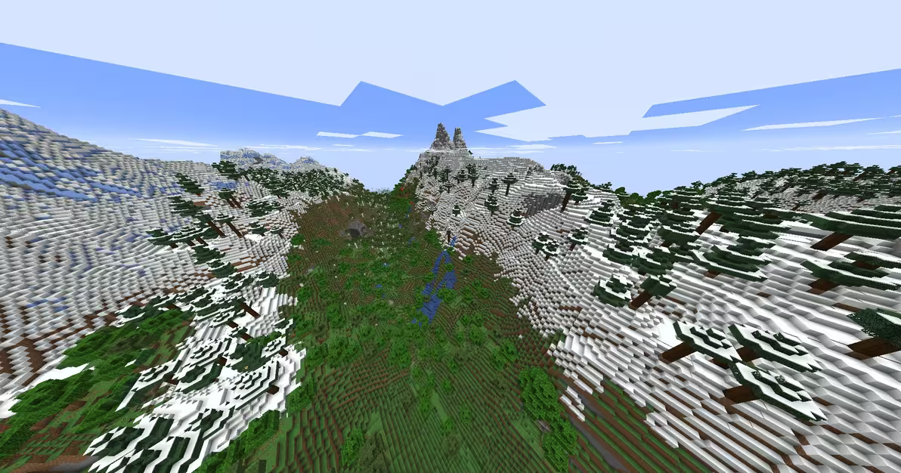

*Fig. 6.4: A good mountain range*

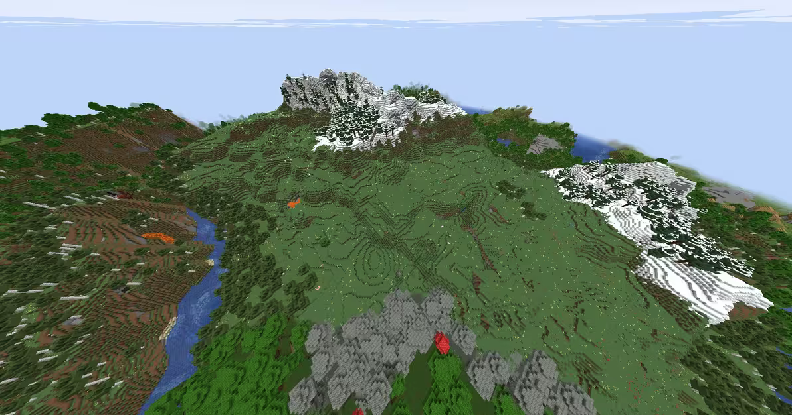

*Fig. 6.5: A bad mountain range*

According to structure generation logic, the world is first divided into 24-chunk wide square regions, then the most northwest 16-chunk square subregion is used to generate ancient cities. As one single ancient city can take up large areas, we are justified to claim that digging in the center of the subregions gives us a better chance of landing straight on some point of the ancient city. The coordinates of the middle chunk of the subregions are $(24n+8, 24n+8)$, where $n$ is some integer. Ninjabrain Bot has a function to calculate the dig down point: F3+C at the area, above `y = 160`. The dig down point should have sky access, to make it easier to see the light from the exit after looting the city.

When digging down for an ancient city, set your pie chart to the same configuration as scanning for buried treasure, observe for changes in the C-counter and the orange portion of the pie chart. A sudden spike in C-counter and orange pie proportion indicates there's probably an ancient city below (does not exclude the possibility of random dungeons). Here are steps on how to explore the ancient city.

First, fly to the central statue. Clear the shriekers on the central statue (shriekers need 4 shrieks to summon the warden). The central statue can then act as a safety point for later, when a warden is summoned we can fly back and wait for the warden to despawn.

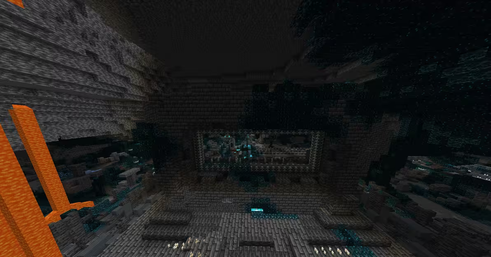

*Fig. 6.6: Central statue of the ancient city*

And dig down under the central statue, there are multiple redstone circuits:

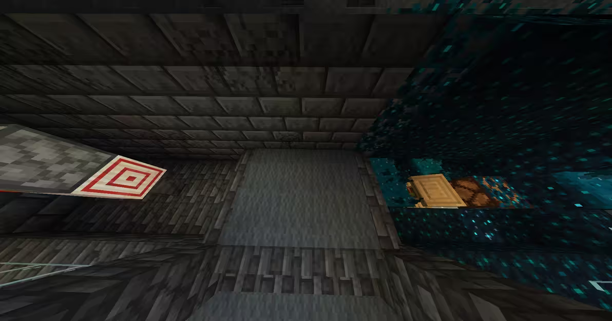

*Fig. 6.7: A room under the central statue, target block on the left, comparator on the right.*

Take the target block on the left, and mine off the lecturn on the right, place a chiseled bookshelf for the advancement "The Power of Books". If you don't have enough redstone, go to the control room for the piston door circuit, get at least 22 redstone dust, 21 for compasses (1.21.5 trading with igloo cartographer), 1 for noteblock. Exit the room, start exploring the outer parts of the ancient city.

The technique for looting is to literally "just grab". Shriekers take 4.5 seconds to shriek, it takes 6.7 seconds for the warden to dig out - sums up to 11.2 seconds for a warden to spawn. This is sufficient for looting 2 chests, and then blocking it off / mine off, and fly away. Items to loot are compasses, bones (skip if you already have a stack), enchantment books (search for swift sneak, channelling and mending), glow berries (ABD, skip if ate), 1 music disc, 2 name tags, leads (cheap in 1.21.6, important for pre 1.21.6), 1 sculk catalyst, 1 amethyst shard, enchanted golden apples, and the two trims. (The expected value for getting two trims is around 4 to 5 ancient cities.) If you need XP, mine sculk blocks using a hoe. Leads are very important for 2B2 - they save a lot of trouble, plus swamps are hard to find in 1.21, so loot them early in ancient cities. Amethyst shard is used to craft a spyglass.

If it's your first ancient city, build a nether portal somewhere far from shriekers, and record coordinates with Ninjabrain Bot. This portal is for HDWGH, so similiarly, nothing should go through this portal for now.

After exiting the ancient city, there will be a meadows biome nearby, complete "The Sound of Music"; singular trees on meadows always come with beehives, cherry blossom forests also have a lot of beehives, so take 2-4 hives; there will be donkeys on the meadows, complete HDM here; do "Light as a Rabbit"; breed goats and complete "Whatever Floats Your Goat!". Goats also provide milk.

## 6.3 - Exploring

After exiting the ancient city with basic resources, it's time to explore on the big axis. My principle when it comes to exploring, is to **follow quadrants**. As the resources needed in 1.21 is way more than 1.16, the area explored will also be larger than 1.16, so it makes more sense exploring according to quadrants to avoid backtracking. At the same time, I look out for missing resources according to the biome's temperature `T` while exploring, and decide whether I should be going to warmer biomes or colder biomes.

1. **First we discuss about oceans.** Exploring oceans requires you to differentiate between good and bad oceans. Different from 1.16, 1.21 oceans do not generate any islands; to identify a good ocean, take note of its area, depth and the distribution of monuments. A good ocean is large in area, and are mostly deep ocean (note: warm oceans do not have deep oceans), and are concentrated with monuments. {TASK: PHRASING} A bad ocean is small in area, mostly shallow, and have no monuments. Avoid bad oceans, as mushroom island can only spawn in a large enough ocean, plus resources are more abundant in good oceans than in bad oceans.

*Fig. 6.8: Good ocean, 2 monuments and some drowned clusters are seen.*

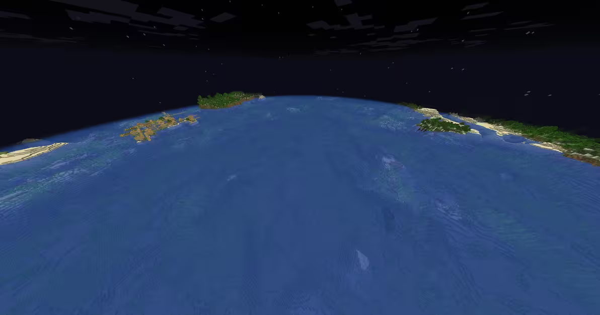

*Fig. 6.9: Bad ocean, small area, shallow depth, no monuments or drowned seen.*

The resources needed from the oceans are shells, trident, mushroom island and gold. For good oceans, if you have obtained shells and trident from river drowned farming earlier, you can skip checking ocean ruins. Before looting monument bring 4-6 buckets of milk, as lowering render distance does not avoid you from being donged. As for the Tide trim, if the monument is close enough to land, kill all 3 elder guardians (48% chance of getting Tide from 3 elder guardians, 73% from 6, 86% from 9, 93% from 12, 96% from 15). On mushroom islands, breed mooshrooms, right click mooshrooms with a bowl to get a mushroom soup, craft a blindness stew (azure bluet), craft a fermented spider eye, if you have an armor stand also do "Arbalistic" here (+ 2-fish, 2-cow). Loot shipwrecks if you see, mainly for minerals (iron for compasses, emeralds for trading come from here) and paper. For bad oceans, if sniffer eggs aren't collected yet then check warm ocean ruins, if it's only shells and trident left you can skip checking ruins. Still loot shipwrecks.

2. **Next, hot biomes.** For deserts, there's still good loot in temples even though they spawn less commonly, so loot if you see. Although the main source of netherite are mostly bastions in 1.21, we do still need TNT just for good measure. Commonly a stack of TNT, or more, is not an issue. Temple gunpowder saves the hassle of farming creepers at night. Sometimes the wooded badlands and savanna plateau are small, making wolves a bit tough to find. Wolves in sparse jungles are relatively easy to find. Jungles in 1.21 are more common than in 1.16, plus leads can be used on boats, so breeding pandas and ocelots are way easier. Also use a spyglass on a parrot. 

3. **Cold biomes.** Four spruce biomes (regular, old growth spruce taiga, old growth pine taiga, snowy taiga) have different wolves to tame, here are their differences: Trees in old growth spruce taiga are tower-shaped, as in Figure 6.10, the chestnut wolves spawn here; trees in old growth pine taiga look like lollipops, I call them "pointy-headed", as in Figure 6.11, the black wolves spawn here. In the first three spruce biomes mentioned, it is easier to find red foxes for breeding.

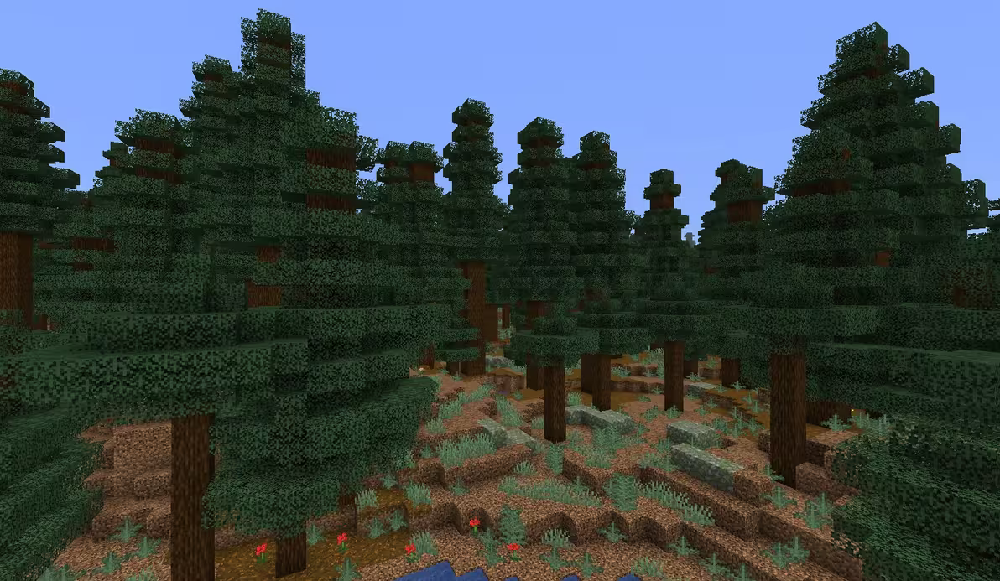

*Fig. 6.10: Old Growth Spruce Taiga. Source: [Minecraft Wiki](https://zh.minecraft.wiki/w/%E5%8E%9F%E5%A7%8B%E9%92%88%E5%8F%B6%E6%9E%97#/media/File:Old_Growth_Spruce_Taiga.png)*

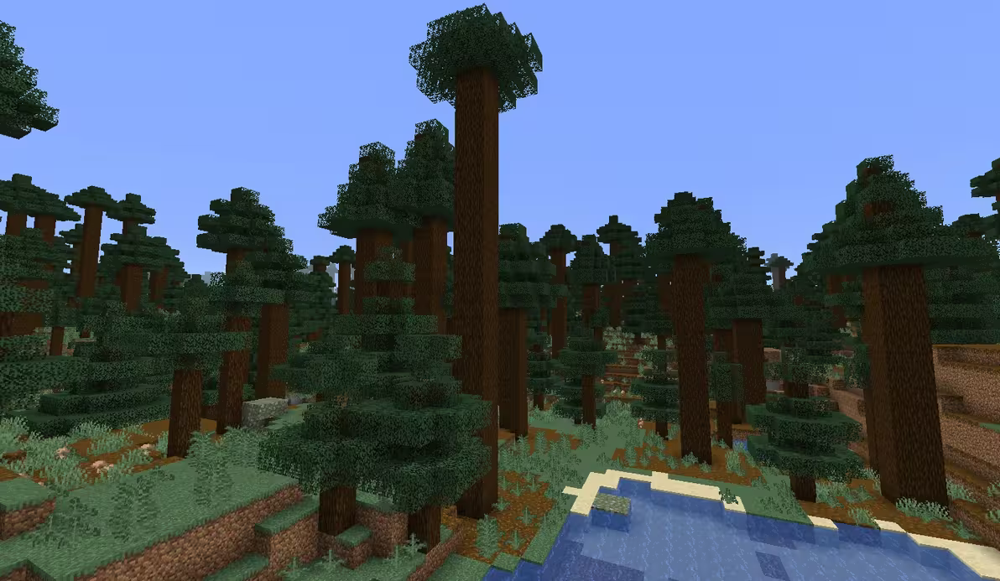

*Fig. 6.11: Old Growth Pine Taiga. Source: [Minecraft Wiki](https://zh.minecraft.wiki/w/%E5%8E%9F%E5%A7%8B%E9%92%88%E5%8F%B6%E6%9E%97#/media/File:Old_Growth_Pine_Taiga.png)*

Groves and snowy taigas are similar too. Groves also have a separate type of wolf to tame - the snowy wolf, the rarest type among wolves, and only spawn in packs of 1. Groves are only covered with snow blocks, with powdered snow in between, as shown in Figure 6.12; snowy taigas on the other hand are covered with grass blocks and ferns, as in Figure 6.13. Grove wolves (translator note: not to confuse with "wolves from snowy taiga". Wolves later on are referred to with its respective biome) are more difficult to differentiate than normal taiga wolves and snowy taigas wolves - it has the whitest appearance, and has "stripes" that resembles fur, as in Figure 6.14.

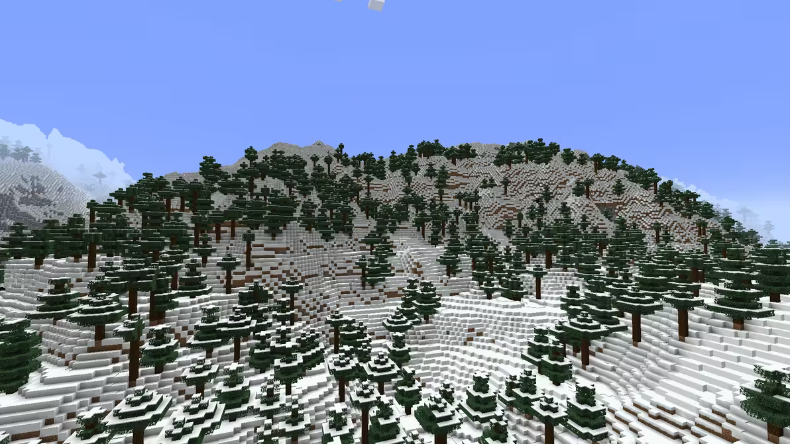

*Fig. 6.12: Grove. Source: [Minecraft Wiki](https://zh.minecraft.wiki/w/%E5%B1%B1%E5%9C%B0#/media/File:Grove.png)
*

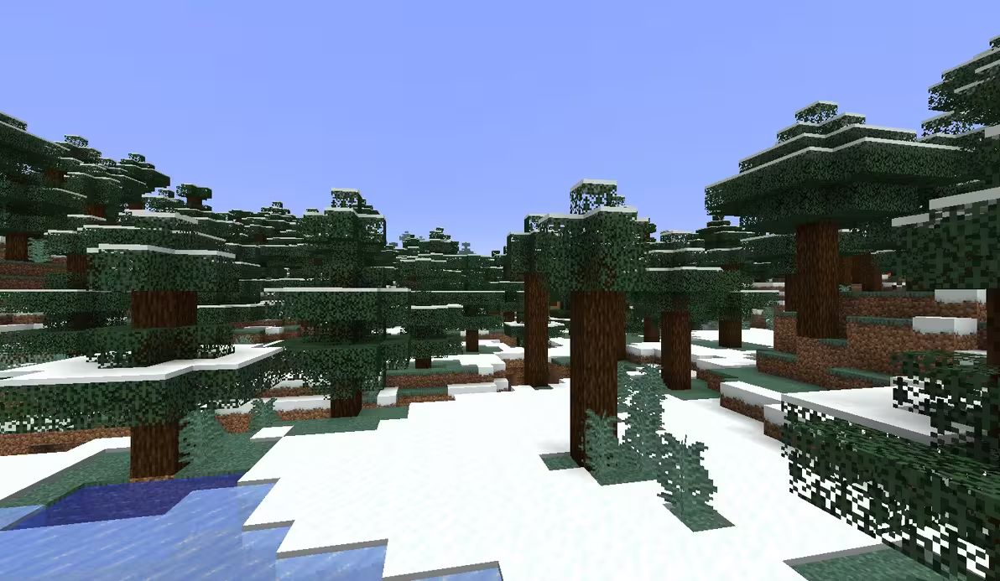

*Fig. 6.13: Snowy taiga. Source: [Minecraft Wiki](https://zh.minecraft.wiki/w/%E9%92%88%E5%8F%B6%E6%9E%97?variant=zh-cn#/media/File:Snowy_Taiga.png)*

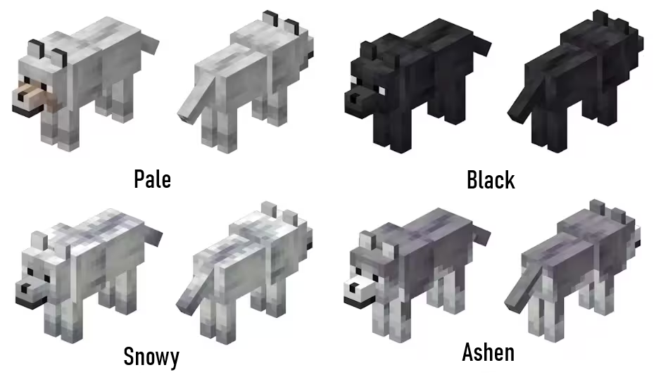

*Fig. 6.14: Variants of wolf fur. Translated from source: [Minecraft Wiki](https://zh.minecraft.wiki/w/%E7%8B%BC#/media/File:MCMonthly_Wolf_Variants_Simplified.png)*

The key to searching for grove wolves, is to find big areas of the grove biome. Groves are mountainous biomes - low erosion biomes, with erosion values of `E = 0 ~ 1`. When `E = 0`, grove temperature values are around `T = 0 ~ 2`; when `E = 1`, grove temperature values are around `T = 0`. Groves have humidity values of `H = 2 ~ 4`. Snowy plains have temperature values of `T = 0`, and their size can be large, with erosion values of `E = 2 ~ 5`, so groves around snowy plains are the largest - simply find groves that connect to large snowy plains. Note that you shouldn't be searching for wolves in groves with sparse mountains - this is inefficient. Try searching through the pie chart or spamming F3+B. Groves can also mix with normal taiga and snowy taiga, so snowy taiga wolves and grove wolves can be found together, which can confuse. Grove wolves can blend into the snow pretty easily given their appearance, so be patient while searching. They are also a bit dumb - sometimes they pathfind into powdered snow, which makes them get frozen.

Igloos can generate in snowy plains, snowy taiga and snowy slopes. Igloos have a 50% chance of generating a basement, searching for igloos with a basement can be found through `minecraft:sign` from the pie chart, similarly as one would do to find a spawner. Igloo splits are different from 1.16 - basically cure both the zombie villagers, and then trade for a mansion map (mansion for Vex trim and evoker, vex kills). Details for the igloo split will be elaborated later.

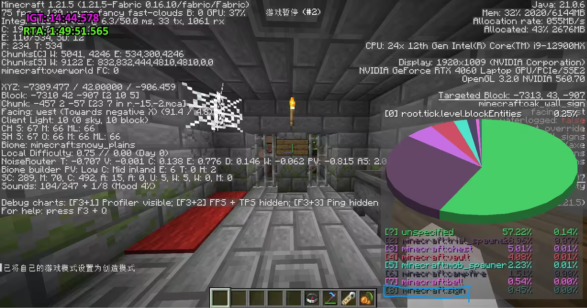

*Fig. 6.15: Inside an igloo, spawner-scanning pie chart. `minecraft:sign`, unique to igloos, can be seen.*

As snowy plains take on values `E = 2 ~ 5, T = 0, H = 0 ~ 2`, ice spikes have values `T = 0, H = 0, W > 0`, swamps have values `E = 6, T = 1 ~ 2`, windswept biomes generate in {continental erosion values of `E = 5`}, windswept gravelly hills have values `T = 0 ~ 1, H = 0 ~ 1`, hence these biomes often generate close together. So, to find the rarest biome - windswept gravelly hills, try flying along the edges of the snowy plains. Llamas can be found in windswept biomes and savanna plateau, breed them.

In swamps, farm slimes for slime balls - in 1.21 AA at least 3 stacks are needed (to accelerate tadpole growth), but one night isn't always enough for 3 stacks of slime balls, so you can do trial chambers, or do oozing potion on endermen to supplement. Note that without sleeping, nights that start at IGT 1h30m, 4h10m, 6h50m will not spawn slimes, as shown in Figure 6.16. After getting at least 13 slime balls, craft one slime block for an oozing potion, 4 slime ballsfor breeding 2 pairs of frogs. The reason for breeding 2 pairs of frogs, is because sometimes only 2 tadpoles hatch from one frogspawn - not enough for advancements needing the 3 types of frogs. Similarly, hatching frogspawn takes 3-5 minutes, which is when miscellaneous advancements are done (discussed later in igloo split). If you haven't collected 3 eggs, wait for chicken, and collect later.

Don't forget to kill the unique skeleton types from the snowy plains and the swamp: the Stray and the Bogged.

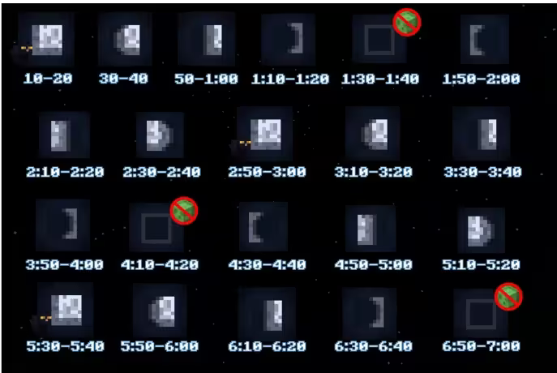

*Fig. 6.16: Moon phases and relations between black cat, slime spawning. Source: [AA Resources Document](https://docs.google.com/document/d/11lVeSXB6N_ZEHDixc3q1zThlVTUQM_4ujgckxnOZ9Fs/edit?tab=t.0#heading=h.1664s55)*

## 6.4 - Igloo and mansion

After entering the igloo, prepare sand, emeralds, glow ink sac, 2 golden apples, take the weakness potion from the basement, use the glow ink sac on the sign, turn difficulty to Hard, infect the two villagers, use water to separate the two villagers, then block them off as shown in Figure 6.17, then cure the two villagers.

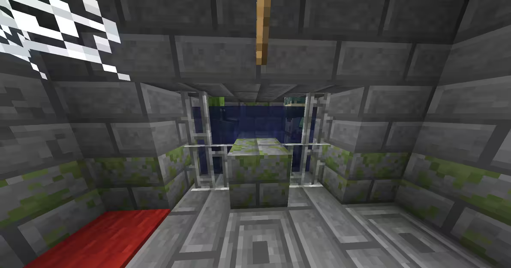

*Fig. 6.17: Two infected zombie villagers separated by water and blocks*

While waiting for villagers to cure, smelt sand for glass (1.21-1.21.4: 12 sand, 1.21.5: 24 sand). Then shear the cobweb for HDWGH later, then do the miscellaneous advancements: "Getting an Upgrade", "Not Today, Thank You", "Crafters Crafting Crafters", "Hired Help", "Bullseye", "Fishy Business", "It Spreads", "Country Lode, Take Me Home". Besides that, do endermite if you have 3-4 stacks of ender pearls, reserve 8 for later. Plant beetroot for 7 beetroot. If you have extra blaze rods / powder, brew oozing potions.

As trading options for cartographers have changed in 1.21.5, with the target being a mansion map, here are instructions for the two version splits:

	i. 1.21-1.21.4: After curing the villager, the trading options are as shown in Figure 6.18, mansion map unlocks at the journeyman level with 2/3 chance. First step is to trade 10 emeralds for 10 empty maps (do not shift click, click 10 times, one by one), then do 4 glass pane trades. Check for the map the next level, if failed, retry on the second villager, or another igloo if it fails again.

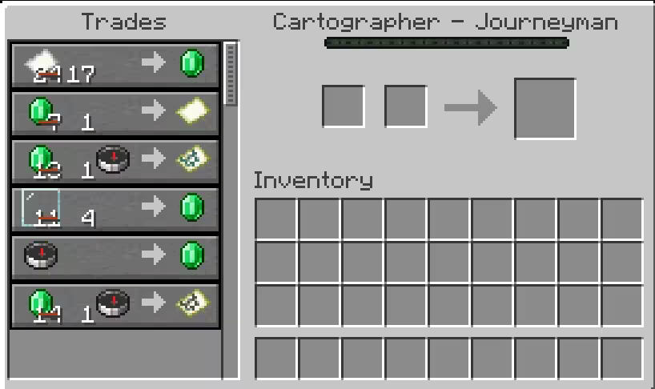

*Fig. 6.18: 1.21-1.21.4 cartographer trading options.*

	ii. 1.21.5: The mansion map trade will show up at the master level. There are 3 possible routes to get to the master level, as shown in Figure 6.19. Note that the route with the glass pane trade is the cheapest on compasses, other routes are expensive on emeralds and redstone. This is why curing two villagers is optimal - check the second trade for the glass pane trade, if both give the other 2/3 trade then it's just bad luck. This is why we loot shipwreck mineral chests, to prevent having not enough resources to trade for a map. 10 extra emeralds are needed if paper trades are not done.

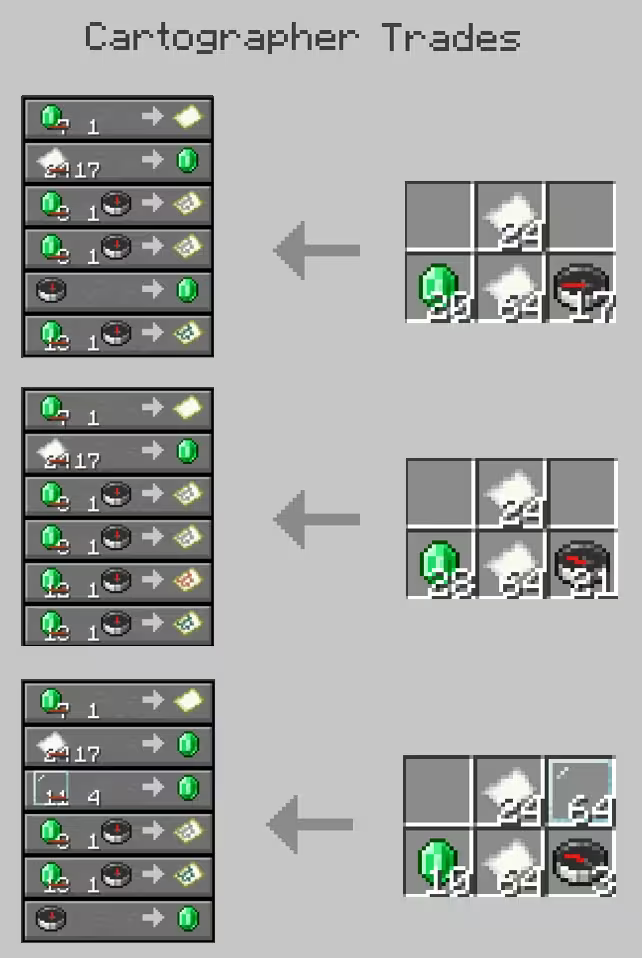

*Fig. 6.19: 1.21.5 cartographer's 3 trading routes. To the right are resources needed. Source: [Post by @KaaziTheCreeper on Discord](https://discord.com/channels/835893596992438372/835898104543707206/1369655370640789605)*

Just explore and follow the map for the mansion, as mansions generate 4 times more {concentrated} than 1.16, the distance needed to travel is relatively shorter. Arriving at the mansion, first loot all the chests, until getting the Vex trim, then head up to the 3rd floor to kill the evoker and vex, and leave after getting the totem. Searching for gunpowder in the mansion is not worth it - too risky as you die easily here. Allays can be found in the jail room in mansions / outpost cages, if found, take 2 cakes, place down a noteblock (not jukebox, the one crafted with redstone), right click the allay with the cake once, click the noteblock, then throw the cake on the ground; when the allay picks it up and gives it back to you (you have to pick it up), two advancements "You Got a Friend in Me" and "Birthday Song" are done.

## 6.5 - Nether

When you think there are nothing else to do in the overworld, or when biome terrain / temperature is not good, head into the nether for nether advancements.

First of all, "Hot Tourist Destinations" is easy to do and gives a lot of XP, so this can be reserved for enchanting trident. As piglin barters don't give glowstone, anchor advancements are typically done during mid-game. For lodestone, in 1.21-1.21.4 if you don't get a bridge bastion then you still need 4 debris; however in 1.21.5 it's easy, as ruined portals include lodestone as loot. For the 20 debris needed for all advancements, get at least 12 from bastions (they have very nice loot), as temples get rarer and typically there's not enough for 2 stacks of TNT for debris mining. Don't forget to portal out to kill zoglin, and breed hoglins; any entity can straight away enter through the portal now, so it's fine to just let the hoglin enter, no need to load the other side. Also, use a spyglass on a ghast, and do "Return to Sender". "Subspace Bubble" is easy.

As for "Uneasy Alliance", frozen chunks don't work anymore - we need to manually hook the ghast into a minecart and execute. Reeling the ghast into minecart takes practice - usually done by off-handing fishing rod, with minecart in main hand. The key is to find a relatively flat and closed-off terrain, which means this advancement requires the right timing. I suggest that you have a fishing rod, minecart and rails ready in your inventory. After trapping the ghast, the original method of killing by igniting TNT is doable, but usually I use this method of sending the TNT through, check out the video below:

[hyperlink6.1](https://www.bilibili.com/video/BV1aFmHYgEac/)

"Feels Like Home" is a bit troublesome - it requires you to ride on overworld lava for 50 blocks, can be lava sources or flowing lava. But it requires 50 blocks on the same y-level. Finding a cave big enough by blind traveling can save a lot of time; if you can't find one, there's an easy method - the lava staircase. As shown in Figure 6.20, portal out to some ocean or river, and build a 50 block long staircase (count by checking y-coordinate), and place a lava bucket on the top of the staircase, as shown in Figure 6.21. Wait for the lava to flow down, this will form a 50-block level of flowing lava. While waiting, complete other miscellaneous advancements, and ride the strider through this path and you're done. Note you must ride on the same level, eg. ride on {flowing level 3 lava}; don't do this during rain - striders get hurt by rain.

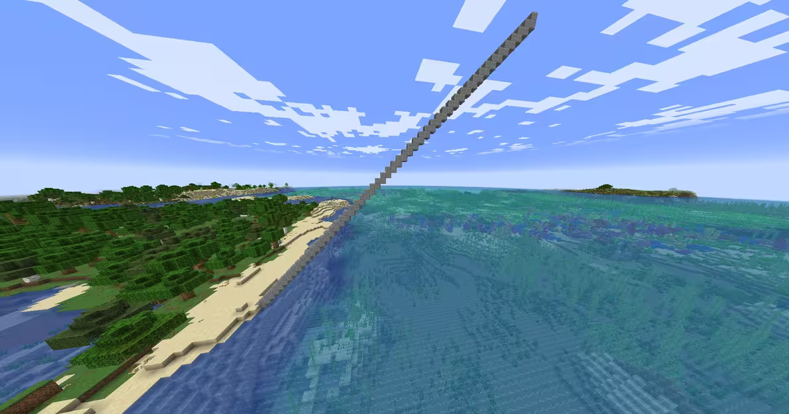

*Fig. 6.20: 50-block long staircase*

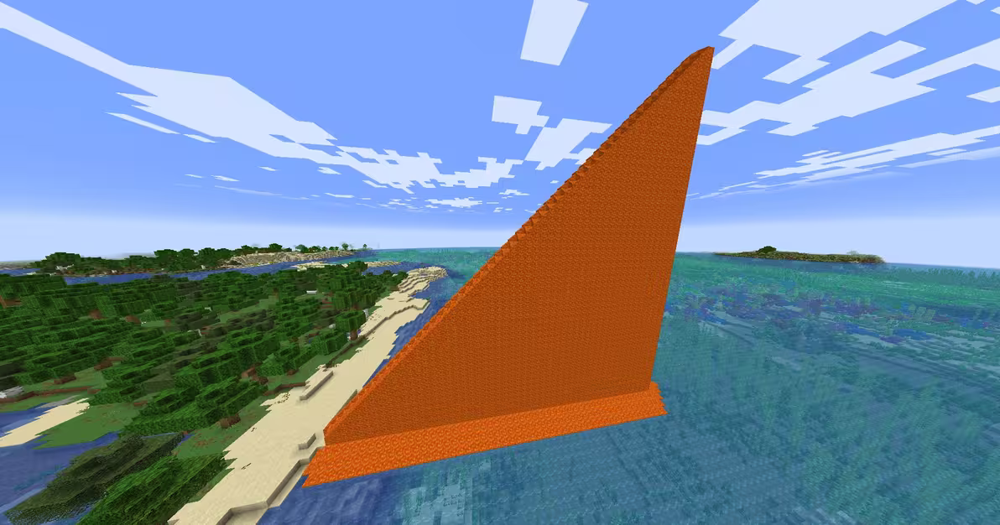

*Fig. 6.21: Lava staircase*

Finding nether fortresses and bastions are important. According to structure generation logic, after finding one structure, you can follow one straight line to find the next structure. There are two trims to collect in these structures, Rib trim from fortresses will be a bit rarer (50% from 10 chests, 75% from 20, 95% from 45); if you spot a potential fortress, get all 3 skulls there. For bastions, loot the gold blocks and obsidian - as obsidian from end cities alone is not enough to sustain a run. Obsidian can also be mined using an Efficiency V diamond pickaxe. Unless there's 1 or 2 things left in mid-game, it's not recommended to use the wither to mine for obsidian in the end to avoid {backtracking}.

If you have 3 stacks of slime balls and 3 tadpole buckets, you can do the frog advancements. Figure 6.22 shows the relation between biomes and frogs.

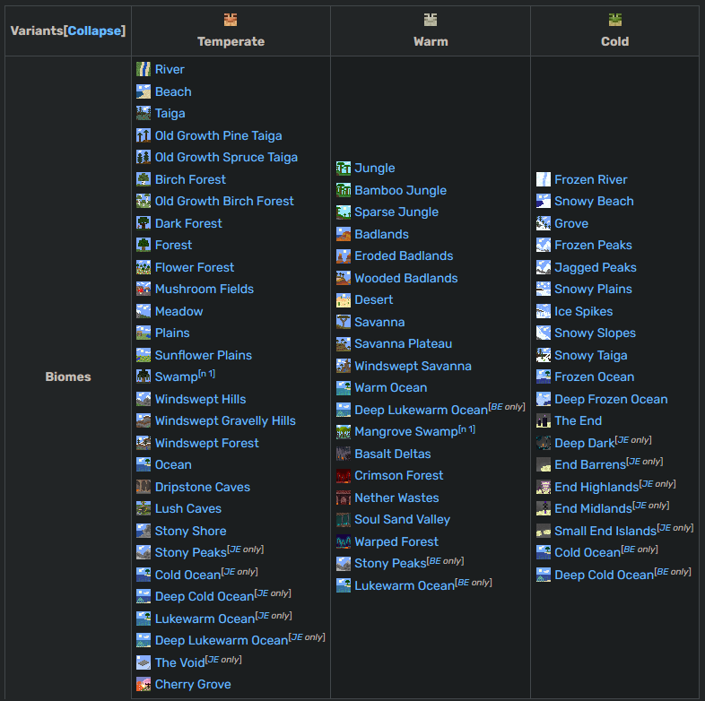

*Fig. 6.22: Frog color and its relation with biomes. Source: [Minecraft Fandom Wiki](https://minecraft.fandom.com/wiki/Frog#Spawning)*

Portal out at places with magma cubes, to check for cold biomes on the other side - it'll save a lot of time if it is. (Deep dark is considered cold as well.) Otherwise you can do the normal frog and the tropical frog. Feed the tadpole at normal biomes (refer to table above) with 40-64 slime balls; for the white frog, feed 40-50 slime balls, then immediately scoop up, then place it in the nether and feed it until growing up.

If you don't have 3 stacks of slime balls yet, frog advancements can wait till endgame - discussed later.

## 6.6 - Trial Chambers

There is only one goal in the Chambers: the heavy core. The trial chambers is more of a late-game structure - when you think there are nothing else to do in the overworld, or when biome terrain / temperature is not good, you can do trial chambers. The resources here are way less valuable than those in ancient cities, so at the start of the mid-game don't do trial chambers first, there's no benefit. Don't pray for a trident here (50% from 33 normal vaults). Related advancements are: "Minecraft: Trial(s) Edition", "Wax On", "Wax Off", "Revaulting", "Under Lock and Key", "Lighten Up", "Who Needs Rockets", "Blowback", "Over-Overkill". The method for doing "Blowback", is to land two diamond axe crit hits on a breeze, then hand-punch twice, and rebound the wind charge to kill the breeze. Heavy core is another luck-based factor, 50% from 9 ominous vaults, 75% from 18, 90% from 30, 95% from 40, 99% from 60; on average one trial chamber has 3-6 ominous vault, so around 2-3 trial chambers will get you the heavy core.

"Over-overkill" is recommended to do on an iron golem, and recommended to do after having the Density enchantment. Another option is to do it on sniffers during end-game. If you don't have Density, 47-block-high damage is needed for the advancement.

## 6.7 - Trail ruins

Trail ruins generate in jungles, all taigas and old growth birch forests, its structure is as shown in Figure 6.23. The red part are the towers, the blue part being the road, the yellow part being rooms, the green part being decorations. Only the top most part of the tower will be exposed on surface, with only some terracotta blocks being exposed and everything else buried. This makes trail ruins hard to find, and requires switching POV constantly to check. It's harder to find in jungles due to vegetation, and also in snowy taigas due to snow; I recommend that you search for these in the birch forests and other taigas.

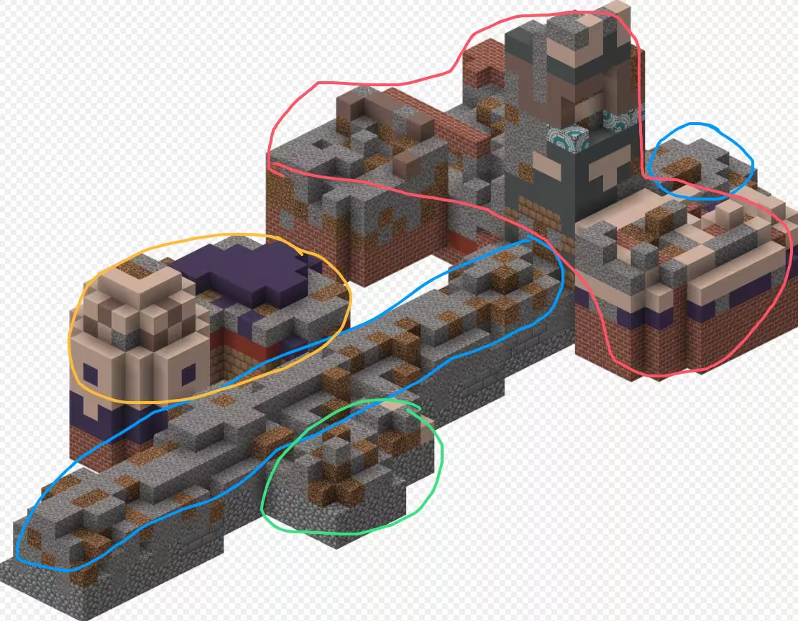

*Fig. 6.23: Trail ruins structure*

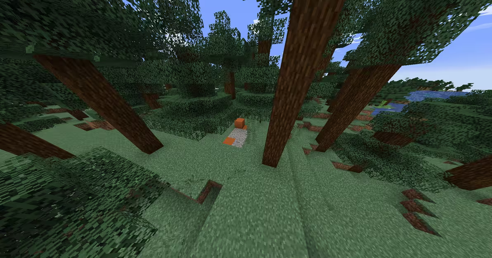

*Fig. 6.24: Trail ruins: only some terracotta blocks and gravel being exposed.*

There's also only one goal for trail ruins: the Wayfinder trim. The Wayfinder trim's icon looks like the greek letter $\Omega$. This trim is considered a rare, the road and the top part of the tower do not roll suspicious gravel that provide rares - the rest of the rooms will spawn 3 rare sus-gravels. For the decoration part however, due to its small size, you might not be able to get all 3. The video below demonstrates how to loot a trail ruin fast.

[hyperlink6.2](https://www.bilibili.com/video/BV1Lb421n7s4/)

## 6.8 - Miscellaneous advancements

1. "Two Birds, One Arrow": Now the hitboxes of the phantom and the boat overlap, which means you cannot damage phantoms in boats. Do two strong diamond axe hits to each phantom before trapping them on boat. You can also use flint and steel: place the boat at the center of the block, light the block on fire and put off immediately, when the phantoms are done burning, repeat once and the phantoms are ready. Shoot a Piercing shot through the boat, off-handing the crossbow and hold a Looting sword in the main hand for more membrane.

2. Axolotl advancements: Axolotl spawn in the waters of lush caves, where clay spawn underneath it. Lush cave only generate at high humidity, one sign is azalea trees on surface. In biomes with lots of vegetation, for example dark forests, lush cave will normally be generated below. Find a large opening to enter, or dig down from an azalea tree if unable to find one. Axolotls might be hard to find.

The advancement "The Healing Power of Friendship" reuqires the player to kill the enemy of the axolotl **and get the effect given by the axolotl** - this is the criteria for the advancement. Note: axolotls in play-dead state do not give the effect.

If you use an axolotl for "Arbalistic", keep a bucket of it in your shulker box. To drop health, place the axolotl, pick up water, land one strong diamond axe hit, and pick up the axolotl.

3. Thunder-related advancements: Extra advancement: "Surge Protector" - requires a thunder strike to happen beside a villager, and not cause fire. Don't get fooled by the advancement icon - no lightning rod is actually needed for this. As shown in Figure 6.25, close to a villager, place 9 buttons and a boat in a middle, and aim the channelling trident at the boat to finish the advancement. In this version, sleeping only affects phantom spawns and not the thunder timer, so after killing phantoms you can simply sleep.

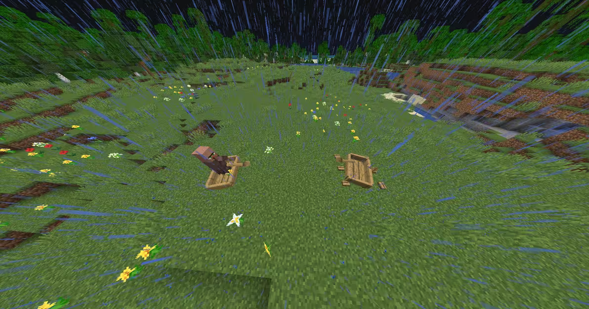

*Fig. 6.25: "Surge Protector" strat setup*

4. Outpost-related advancements: It is recommended that if you find an outpost during daytime, with flat and open terrain, immediately farm for 5-6 ominous bottles, if you have a cake and there's an allay, do allay advancements. Don't forget to kill a pillager with a crossbow.

## 6.9 - Charts: AA Mid-game odds

Figure 6.26 and Figure 6.27 show the tables regarding AA mid-game probabilities; with my understanding, if odds hit 75% and you haven't got it, think about resetting; if odds hit 90%, reset. [Link to the complete spreadsheet](https://docs.google.com/spreadsheets/d/1iFG7_9Zq-LyNuExj_AW37n34oTHaZnjgON3AW1Oh_9c/edit?usp=sharing) - or also found in MCSR Javacord.

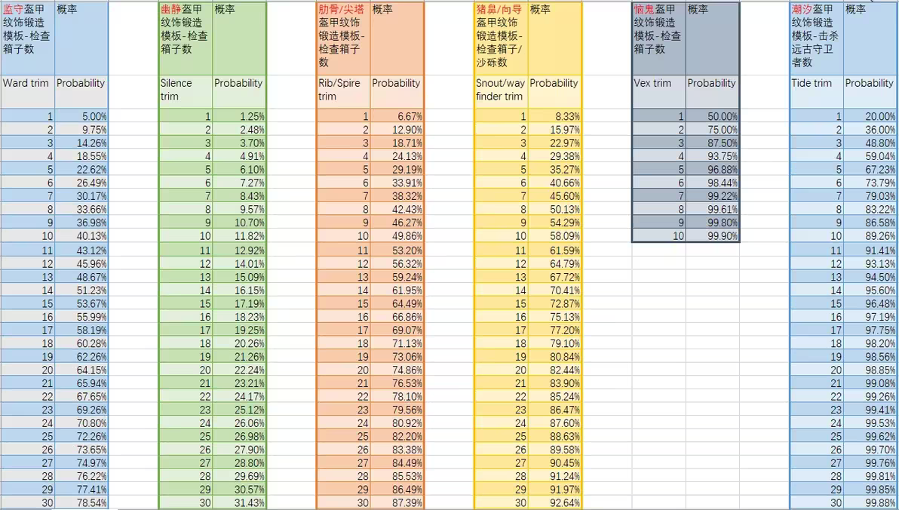

*Fig. 6.26: Table of odds of obtaining trims for 1.21 AA*

*Fig. 6.27: Table of miscellaneous probabilities for 1.21 AA*

## 6.10 - Where does mid-game end?

When all that's left is what shown in Figure 6.28, dogs, cats, trims, biomes etc. big advancements are done, 2*64 + 36 = 164 gold blocks collected, 3 skulls collected, has 8 shells, mace, at least 12 debris, brewing materials ready (golden carrot, sugar, fermented spider eye, blaze powder, pufferfish, phantom membrane, breeze rod, cobweb, slime block, stone block): you can start end-game.

*Fig. 6.28: Progress while doing end-game. Note that some miscellaneous advancements aren't done yet; in real runs more should be done than this.*

# 7 - End-game

## 7.1 - Second outer end

After mid-game, return back to the end for shulker transport. The method here is to use leads to pull boats. If the Spire trim is not found yet, search for it until found, then proceed to shulker transport immediately. The shulker can be straight away sent through the end portal. If you don't have enough for 3 stacks of slime balls / not enough perals for endermite, kill endermen. One way to quickly farm slime balls, is to get endermen into a 2*3*3 hole, splash the endermen with an oozing splash potion, then use TNT to kill endermen, this spawns a lot of slime, kill the slime for slime balls. If there's only 1 or 2 things left in mid-game, you can spawn the wither to mine for obsidian from the pillars.

## 7.2 - Bees, HDWGH setup

In this version, nether bees are not needed, as you can just sleep to skip nights and not affect the thunder timer (don't sleep during rain if you still need thunder, and thunder hasn't happened yet). Normal bees' setup is fine. End-game normally takes around 50 minutes. A brewing guide for HDWGH is as shown in Figure 7.1, all the effects needed are as shown in Figure 7.2:

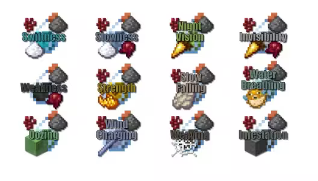

*Fig. 7.1: HDWGH potion brewing diagram. Source: [Graphics by @LNXS](https://docs.google.com/document/d/11lVeSXB6N_ZEHDixc3q1zThlVTUQM_4ujgckxnOZ9Fs/edit?tab=t.0#heading=h.19c6y18)*

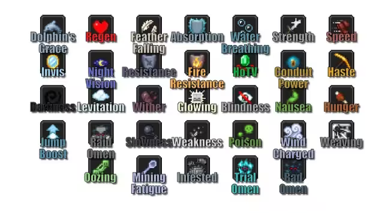

*Fig. 7.2: Effects required for HDWGH. Source: [Graphics by @LNXS](https://docs.google.com/document/d/11lVeSXB6N_ZEHDixc3q1zThlVTUQM_4ujgckxnOZ9Fs/edit?tab=t.0#heading=h.19c6y18)*

Refer to the video below for a traditional HDWGH setup:

[hyperlink7.1](https://www.bilibili.com/video/BV1k7iPeeEdc/?vd_source=6354c34fc27dd8d2c805acb65b2e16ab)

Build portals on the nether roof to link to the portals at the monument and the ancient city, and transport the warden back to the overworld. Remember to make 3-block high barrier at the overworld portal to prevent the warden from escaping. Name tag the warden.

Here are points that are easy to miss. First is to not misplace the villager / forget the villager; second is to deplete half a hunger point, to eat the puffer fish; third thing is, it is not recommended to use a dispenser for Glowing effect - better shoot yourself with a bow; fourth is to be fast after drinking the ominous bottle, as raid omen only lasts 30 seconds; fifth is that 1.21.4 fixed the bug where the player is still able to swim while having blindness, so in 1.21.4+, eat the enchanted golden apple, then the blindness stew.

Refer to the video below for a new HDWGH setup, for 1.21.2+:

[hyperlink7.2](https://www.bilibili.com/video/BV1q6L1z2Epq/)

## 7.3 - Frogs and sniffers

If frog advancements are done at end-game, find a basalt delta biome on the nether roof, and make a platform to spawn magma cubes. The white frog grows up at the spawn desert, the normal frog grows up at the spawn river, the green frog grows up at the ancient city, then transport the three frogs to the magma cube spawning platform for froglight advancements.

Sniffers should have dug up a lot of ancient seeds into the hopper at end-game. Plant an ancient seed for "Planting the Past". Breed the sniffers, collect the sniffer egg and place it down; after 20 minutes of hatching, feed a torchflower seed to the little sniffer. "Over-Overkill" can be done using sniffers.

## 7.4 - Miscellaneous, third outer end

- Star Trader: Lead the boat up to `y = 320`, then trade.

- Caves and Cliffs: Do this in the end: fly up to `y = 320`, and eat an enchanted golden apple, fly down to `y = -64` and done. Gliding is okay during the descent, but no ascending. The enchanted golden apple is to prevent getting killed by the void. (translator note: comments say `y = -60` is enough, and no need for a notch.)

- During the third outer end session, bring enchanted golden apple(s), 4 end crystals, a spyglass, and a glass bottle if dragon's breath is not yet collected. Respawn the ender dragon, and look at the dragon with a spyglass. At this point all the advancements should be finished. 🎉